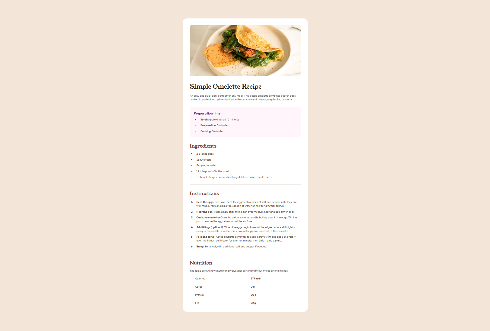

# Frontend Mentor - Recipe page solution

This is a solution to the [Recipe page challenge on Frontend Mentor](https://www.frontendmentor.io/challenges/recipe-page-KiTsR8QQKm). Frontend Mentor challenges help you improve your coding skills by building realistic projects.

## Table of contents

- [Overview](#overview)
  - [The challenge](#the-challenge)
  - [Screenshot](#screenshot)
  - [Links](#links)
- [My process](#my-process)
  - [Built with](#built-with)
  - [What I learned](#what-i-learned)
  - [Continued development](#continued-development)
  - [Useful resources](#useful-resources)
- [Author](#author)
- [Acknowledgments](#acknowledgments)

## Overview

### The challenge

Users should be able to:

- View the recipe page on different screen sizes
- See hover/focus states on interactive elements (e.g., the avatar link)
- View structured content for preparation time, ingredients, instructions, and nutrition information

### Screenshot



> _Tip: Use your browser or a tool like FireShot to capture your screenshot and save it in your project directory._

### Links

- **Solution URL:** [Solution repo](https://github.com/LelloX-Dev/recipe-page-repo)
- **Live Site URL:** [Live site](https://lellox-dev.github.io/recipe-page-repo/)

## My process

### Built with

- Semantic HTML5 markup
- CSS custom properties
- Flexbox layout
- Mobile-first workflow
- Custom fonts (`Young Serif` and `Outfit`)
- Responsive design with media queries

### What I learned

This project helped me practice:

- **Semantic structuring** of long-form content using `<section>`, `<ul>`, `<ol>`, and `<table>`
- Implementing **custom list counters and bullets** using pseudo-elements
- Creating a responsive layout using **media queries**
- Managing **vertical spacing and padding** for a readable layout

Here’s a sample of how I styled list items with custom bullets:

```css
ul li::before {
  content: "•";
  color: var(--brown-800);
  font-weight: 700;
  position: absolute;
  left: 0.5rem;
}
```

### Continued development

In the future, I’d like to:

- Explore **accessibility improvements**, such as better focus outlines and ARIA attributes
- Add **theme toggle support** (light/dark mode)
- Consider using **CSS Grid** to handle more complex layout arrangements

### Useful resources

- [MDN Web Docs - Lists](https://developer.mozilla.org/en-US/docs/Web/HTML/Element/ul)
- [CSS Tricks - Custom List Styles](https://css-tricks.com/custom-list-number-styling/)
- [Frontend Mentor Discord Community](https://discord.gg/frontendmentor) – Great for feedback and tips

## Author

- Frontend Mentor – [@LelloX-Dev](https://www.frontendmentor.io/profile/LelloX-Dev)
- GitHub – [@LelloX-Dev](https://github.com/LelloX-Dev)

## Acknowledgments

Thanks to the Frontend Mentor community and creators for such detailed and accessible challenges. A great exercise in clean design and well-structured markup.
